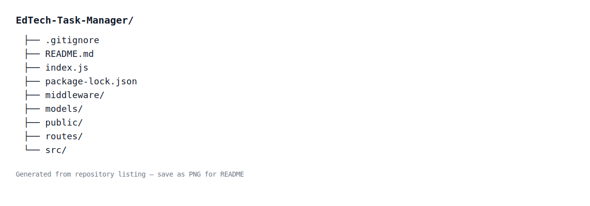

# EdTech Task Manager

A simple task manager that helps teachers assign tasks and students track progress — built with a React client and a Node/Express server.

## Features
- Teacher: create task templates and assign tasks to students
- Student: view assigned tasks and update progress
- Authentication (signup/login)
- REST API with JWT-protected routes

## Tech stack
- Frontend: React
- Backend: Node.js, Express
- Database: MongoDB (or another supported DB)
- Auth: JWT

## Quick start

Prerequisites
- Node.js (>=14)
- npm or yarn
- MongoDB (local or Atlas)

Install and run

1. Clone the repo
   git clone https://github.com/kvVyshnavi/Edtech-Task-Manager.git
   cd Edtech-Task-Manager

2. Server
   cd server
   npm install
   Create a .env file (see example below)
   npm start

3. Client
   cd ../client
   npm install
   npm start

By default:
- Server: http://localhost:5000
- Client: http://localhost:3000

## Environment variables (example)
In server/.env:
- PORT=5000
- MONGO_URI=your_mongo_connection_string
- JWT_SECRET=your_jwt_secret

## Project structure

Figure: Repository file structure (top-level)

EdTech-task-manager/
│
├── client/
│   ├── public/
│   │   ├── index.html
│   │   └── favicon.ico
│   │
│   ├── src/
│   │   ├── App.js
│   │   ├── index.js
│   │   ├── api/
│   │   │   └── api.js
│   │   │
│   │   ├── assets/
│   │   │   └── home-bg.jpg        ← homepage picture
│   │   │
│   │   ├── components/
│   │   │   ├── Navbar.jsx
│   │   │   └── Footer.jsx   (optional)
│   │   │
│   │   ├── pages/
│   │   │   ├── Home.jsx
│   │   │   ├── Login.jsx
│   │   │   ├── Signup.jsx
│   │   │   ├── TeacherDashboard.jsx
│   │   │   └── StudentDashboard.jsx
│   │   │
│   │   ├── styles/
│   │   │   ├── home.css
│   │   │   │   ├── auth.css
│   │   │   │   ├── navbar.css
│   │   │   │   └── dashboard.css
│   │   │   │
│   │   │   └── styles.css   (global optional)
│   │   │
│   ├── package.json
│   └── README.md
│
├── server/
│   ├── index.js
│   ├── package.json
│   │
│   ├── config/
│   │   └── db.js
│   │
│   ├── middleware/
│   │   └── auth.js
│   │
│   ├── models/
│   │   ├── User.js
│   │   ├── TaskTemplate.js
│   │   ├── TaskProgress.js
│   │   └── PersonalTask.js
│   │
│   ├── routes/
│   │   ├── authRoutes.js
│   │   └── taskRoutes.js
│   │
│   └── .env
│   |
└── README.md

## Contributing
Contributions welcome. Fork the repo, create a branch, make changes, and open a PR.

## License
MIT